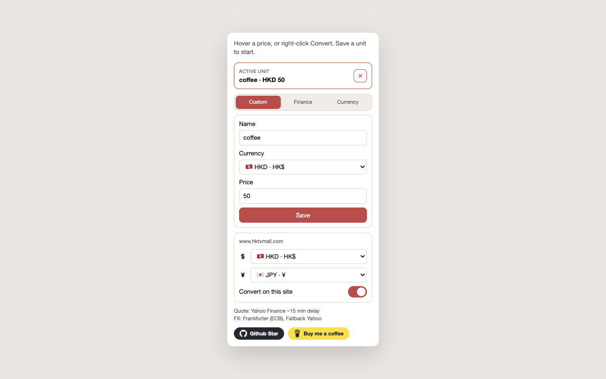

# My Unit

Chrome extension that converts webpage prices into **one** unit you choose: a custom item (coffee at HK$50), a [Yahoo Finance](https://finance.yahoo.com) ticker (`0700.HK`, `BTC-USD`), or a display currency.

<p align="center">
  
</p>

Hover an underlined price, or select one and right-click **Convert**. The original amount stays on the page.

## Features

- Matches amounts that already include a currency signal (`HK$310.00`, `$ 43.00`, `HKD 78.37`). Bare numbers are ignored.
- Custom item, Yahoo ticker, or ISO currency as the single unit.
- Per-site `$` and `¥` overrides, and a pause toggle, in the popup.
- Optional website access: underline prices only on sites you allow. Right-click Convert still works on the current tab without that grant.
- English and Traditional Chinese UI (`en`, `zh-HK`, `zh-TW`), following Chrome’s language. Simplified Chinese falls back to English.

Unmarked `$` and `¥` follow marked prices on the page when those marks agree (for example US$ or HK$). Otherwise `$` is HKD. A per-site `$` or `¥` in the popup wins over that guess, and applies to other dollar-style or yen-style prices on that site. FX uses [Frankfurter](https://frankfurter.dev) (ECB daily rates); currencies the ECB omits (such as TWD) fall back to Yahoo. Live tickers poll Yahoo’s unofficial chart API about every 15 minutes. Quotes can be delayed or break; custom units still work if Yahoo is down. Nothing from the page is uploaded.

Amazon list / “was” prices and CSS `line-through` amounts are skipped. Amazon `.a-price` widgets are handled the same way as [Opportunity Cost](https://github.com/TFTC-Holdings-Inc/opportunity-cost) (reimplemented, not copied).

## Install

The Chrome Web Store listing is in progress. Until it is live, load the extension unpacked:

1. Clone this repo
2. Chrome → `chrome://extensions` → enable **Developer mode**
3. **Load unpacked** → this folder (the directory that contains `manifest.json`)
4. Pin **My Unit**, save a unit, and allow website access when Chrome asks

Do not pack `store/`, `test/`, or `.git` if you zip a build.

## Usage

1. Open the popup and save a custom item, a ticker, or a currency.
2. On a page you have allowed, underlined prices show the conversion on hover.
3. Anywhere, select a price and use the right-click menu.
4. Pause a hostname from the popup if you do not want underlines there (internet banking, and so on).

## Development

Vanilla Manifest V3. No bundler.

| Path | Role |
| --- | --- |
| `background.js` | Service worker: storage, FX, Yahoo, injection, context menu |
| `content.js` / `content.css` | Price scan, underline, tooltip |
| `popup.*` | Settings UI |
| `lib/` | Shared parse / convert / currency lists |
| `_locales/` | Chrome i18n catalogs |
| `test/parse.test.js` | Parser and conversion checks |

```bash
node test/parse.test.js
```

Store listing copy and the promo tile live in [`store/LISTING.md`](store/LISTING.md). Apple / Tabelog / 28Hse screenshots are local dashboard assets and are gitignored.

### Manual checks

These are the three live-site scenes used for the store listing (screenshots stay local and gitignored). Exact tooltip numbers move with FX and Yahoo.

| Page | Saved unit | What to hover |
| --- | --- | --- |
| [Apple HK iPhone](https://www.apple.com/hk/iphone/) | Custom: coffee · 50 HKD | iPhone Duo `HK$17,499` → about 350 coffee |
| [Tabelog Tokyo](https://tabelog.com/tokyo/) | Currency: HKD | A listing `￥4,000` → HKD |
| [28Hse rent](https://www.28hse.com/rent) | Finance: `BTC-USD` | Monthly `租 $20,500` (HKD) → Bitcoin |

Stay on the Japanese Tabelog host so yen amounts remain `￥`. On 28Hse, unmarked `$` is HKD.

## Contributing

Issues and pull requests are welcome at [github.com/fun2code852/my-unit](https://github.com/fun2code852/my-unit). Please run `node test/parse.test.js` before sending a PR.

## Privacy

See [PRIVACY.md](PRIVACY.md). The Chrome Web Store privacy URL should point at that file on `main`.

## License

[MIT](LICENSE). Amazon widget approach inspired by Opportunity Cost (MIT).
